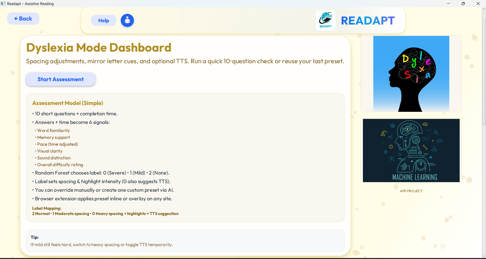
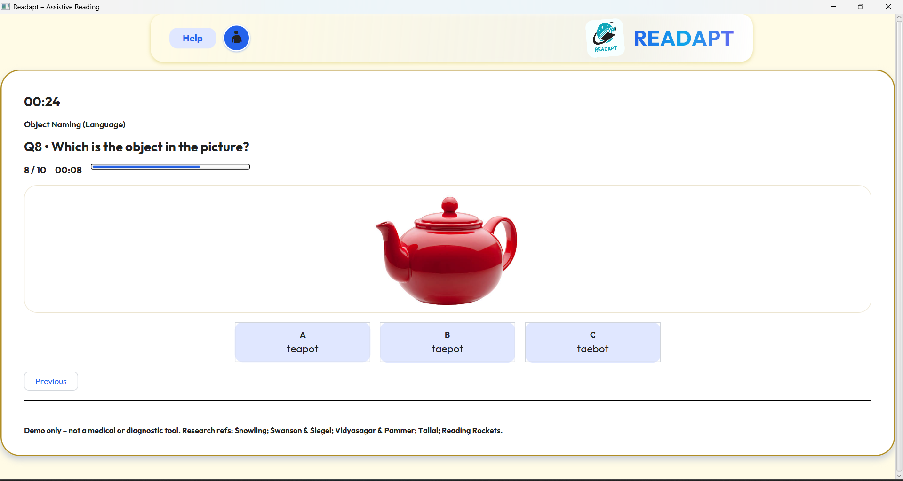
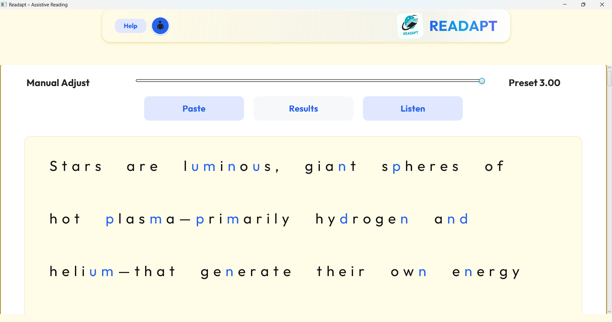
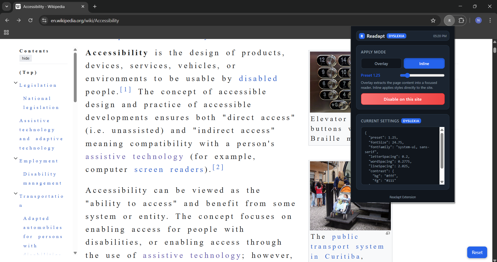
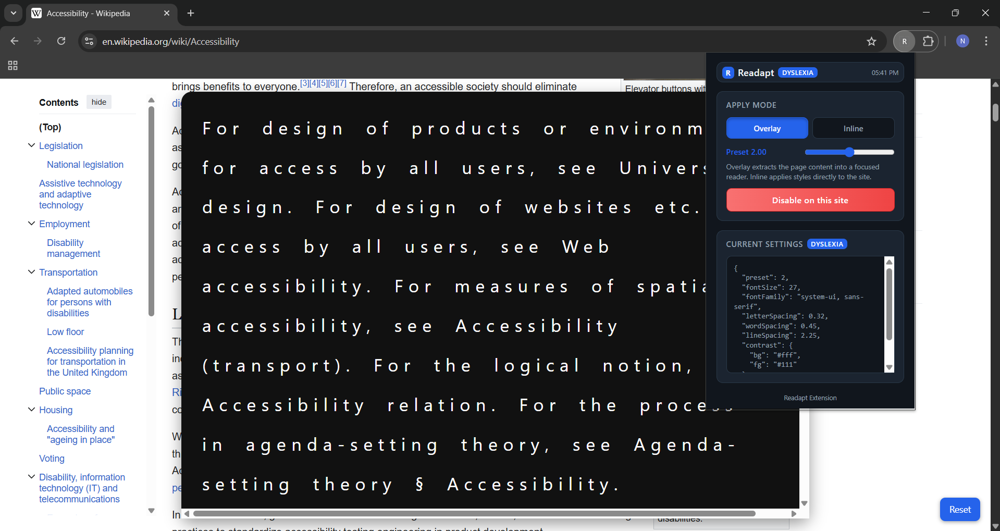

# Readapt

**Readapt** is an advanced, research-driven edutech tool designed to make reading more accessible, engaging, and personalized for every student—not just those with dyslexia. By combining adaptive text presentation, AI-powered assessment, OCR, and a seamless browser extension, Readapt empowers learners to read with ease, comfort, and confidence across desktop applications and the web.

---

## Table of Contents

- [Problem Statement](#problem-statement)
- [Project Overview](#project-overview)
- [Key Features](#key-features)
- [Architecture](#architecture)
  - [Module Breakdown](#module-breakdown)
- [How It Works (User Flow)](#how-it-works-user-flow)
- [Setup & Installation](#setup--installation)
  - [Backend](#backend)
  - [Frontend](#frontend)
  - [Browser Extension](#browser-extension)
- [ML Model: Training & Integration](#ml-model-training--integration)
- [Customization and Extensibility](#customization-and-extensibility)
- [Credits & Acknowledgements](#credits--acknowledgements)

---

## Problem Statement

Modern academic life demands that students process vast amounts of text. However, not all students have the same reading preferences or abilities. Many face challenges due to dyslexia or other neurodiversities—yet even neurotypical learners benefit from text that is spaced, highlighted, and adapted to their comfort.

**The challenge:**  
- Reading interfaces are often rigid and not personalized.
- Dyslexic students struggle with common letter confusions, crowded text, and lack of supportive features.
- Non-dyslexic students also benefit from adapted text for focus, fatigue reduction, and comprehension.
- Most assistive tools are either too generic or only available in web browsers.

**Readapt** aims to bridge this gap by delivering personalized, scientifically-informed reading environments for all students, both as a desktop application and as a real-time browser extension.

---

## Project Overview

Readapt is a cross-platform suite that includes:
- **A desktop application (JavaFX):** Allows students to assess their reading needs, configure and preview text adaptations, and use OCR for images.
- **A backend server (Spring Boot):** Handles AI-powered assessment and OCR processing.
- **A browser extension:** Applies the same personalized reading adaptations to any web page, inline or as an overlay.

Readapt is built for **everyone**—students with dyslexia, students learning new languages, or anyone who wants to make their reading experience more comfortable and focused.



---

## Key Features

- **Personalized Reading Modes:** Begin with a quick assessment to determine your optimal reading settings, or manually adjust presets.
- **Adaptive Text Presentation:** Spacing, letter cues, and TTS (text-to-speech) are tuned to your needs.
- **AI-Driven Assessment:** Complete a 10-question quiz; a machine learning model identifies your ideal adaptation level.
- **OCR Integration:** Extract and adapt text from images or screenshots.
- **Real-Time Monitoring Agent:** Detects reading pauses and suggests adjustments.
- **Custom Presets:** Fine-tune your preset manually.
- **Browser Extension:** Instantly apply your preset to any online text—either inline (directly on the page) or via a distraction-free overlay.
- **Accessible for All:** Designed for both dyslexic and non-dyslexic users.

---

## Architecture

```
+-----------------------+       +-----------------------+        +-------------------------+
|   JavaFX Frontend     | <---> |     Spring Boot       | <----> |   ONNX ML Model (.onnx) |
|  (Desktop App)        |  REST |  Backend Server       |        |  & OCR (Tesseract)      |
+-----------------------+       +-----------------------+        +-------------------------+
        |                                                       
        | Settings/Presets
        v
+-----------------------+                                           
|  Browser Extension    | <---------------------------------------+
|  (Chrome/Edge)        |    Applies presets to ANY website       |
+-----------------------+                                         |
```

### Module Breakdown

- **Frontend (JavaFX):**
  - Multi-page UI (Modes → Dashboard → Assessment → Results → Paste → Adapt)
  - Live adaptation preview and TTS
  - Monitoring agent for reading pauses
  - Image OCR integration

- **Backend (Spring Boot):**
  - REST API for ML model inference (`/predict-dyslexia`)
  - REST API for OCR (`/ocr`)
  - Loads ONNX model exported from Python (RandomForestClassifier)
  - Uses Tess4J for OCR

- **Browser Extension:**
  - Manual preset slider (1–3, in 0.25 steps)
  - Overlay/inline adaptation modes
  - Letter confuser highlighting (for b/d/p/q/m/n/u) at highest preset
  - Persistent settings via Chrome storage

---

## How It Works (User Flow)

1. **Launch Readapt Desktop App**
   - Start at the *Modes Page*: Choose your reading support mode (Dyslexia for now).
2. **Dyslexia Dashboard**
   - Review features and scientific basis.
   - Click *Start Assessment*.

3. **Assessment Quiz**
   - 10 quick questions test your reading, memory, and phoneme skills.
   - Time taken is tracked.

   

4. **ML Model Prediction**
   - Answers + time are converted to 6 features.
   - Random Forest classifier predicts:  
     - 0: Severe (max support)  
     - 1: Mild  
     - 2: None (normal)
5. **Results Page**
   - See your recommended preset and breakdown.
   - Option to redo, go back, or proceed.
6. **Paste Page**
   - Paste or type text, use sample, or upload an image for OCR.
7. **Adapt Page**
   - Text is rendered with your preset (spacing, cues, TTS).
   - Adjust manually if desired. Monitoring agent can suggest increases if you're inactive.

   

8. **Export/Sync Preset**
   - See what feels best? Use the browser extension to apply the same preset on any website.
9. **Browser Extension (Inline & Overlay Modes)**
   - Use the preset slider to select your preferred adaptation (steps of 0.25, from 1 to 3).
   - Visit any website (e.g., Wikipedia) and click the floating "Readapt" button to instantly adapt all text *inline*—right on the page, or in overlay mode for a focused reading experience.
   - At the highest preset, letter hints for b/d/p/q/m/n/u are enabled.

   **Demo: Readapt Adapting Wikipedia Inline**

   

   *Above: Readapt adapts Wikipedia’s article text inline—spacing, font size, and letter highlights are applied directly to the page you’re on!*

   **Demo: Readapt Adapting Wikipedia with Overlay**

   

   *Above: Readapt overlay extracts Wikipedia’s main article into a distraction-free reader, applying your chosen preset for comfort and accessibility.*

---

## Setup & Installation

### Backend

**Requirements:**  
- Java 17+  
- Maven

**Steps:**
```sh
cd "D:\Readapt java\Readapt-backend"
mvn clean package

# Run the backend server
java -jar target\ReadaptBackend-1.0-SNAPSHOT.jar
```

The backend will start on `http://localhost:8080` and expose:
- `POST /api/predict-dyslexia` – Receives answers/timing, returns label and features.
- `POST /api/ocr` – Accepts an image, returns extracted text.

**Note:**  
- Make sure your `model.onnx` (see below) is present in `src/main/resources/ml/`.
- Tess4J OCR will require path to tessdata (see code, e.g., `D:/OCR/`).

---

### Frontend

**Requirements:**  
- Java 17+  
- JavaFX SDK 21+ (download and unzip; set path)

**Steps:**
```sh
cd "D:\Readapt java\Readapt-frontend\src\main\java"
javac --module-path "D:\javafx-sdk-21.0.8\lib" --add-modules javafx.controls,javafx.fxml,javafx.media -d ..\..\..\out com\readapt\Main.java

cd "D:\Readapt java\Readapt-frontend"
java --module-path "D:\javafx-sdk-21.0.8\lib" --add-modules javafx.controls,javafx.fxml,javafx.media -cp out com.readapt.Main
```

---

### Browser Extension

**Requirements:**  
- Chrome or Edge (Manifest v3 compatible)

**Steps:**
1. Open `chrome://extensions`
2. Enable "Developer mode"
3. Click "Load unpacked" and select the `Readapt-extension` folder
4. Optionally pin the extension for quick access

**Usage:**
- Open the extension popup.
- Use the preset slider to select your preferred adaptation (steps of 0.25, from 1 to 3).
- Visit any website (e.g., Wikipedia) and click the floating "Readapt" button to instantly adapt all text *inline*—right on the page, or use overlay mode for a focused reading experience.
- At the highest preset, letter hints for b/d/p/q/m/n/u are enabled.

**Demo: Readapt Adapting Wikipedia Inline**


*Above: Readapt adapts Wikipedia’s article text inline—spacing, font size, and letter highlights are applied directly to the page you’re on!*

**Demo: Readapt Adapting Wikipedia with Overlay**


*Above: Readapt overlay extracts Wikipedia’s main article into a distraction-free reader, applying your chosen preset for comfort and accessibility.*

---

## ML Model: Training & Integration

The machine learning model is a Random Forest classifier trained in Python (scikit-learn) on 10 quiz answers + completion time, scaled down to 6 features. It is exported to ONNX for Java backend inference.

**Training Pipeline (Python):**
```python
import pandas as pd
from sklearn.model_selection import train_test_split, GridSearchCV
from sklearn.preprocessing import StandardScaler
from sklearn.ensemble import RandomForestClassifier
from sklearn.pipeline import Pipeline
import skl2onnx
from skl2onnx.common.data_types import FloatTensorType

# Load your CSV
data = pd.read_csv("labelled_dysx.csv")
X = data.drop(columns=['Label'])
y = data['Label']

X_train, X_test, y_train, y_test = train_test_split(X, y, test_size=0.2, stratify=y)
pipeline = Pipeline([
    ('scaler', StandardScaler()),
    ('rf', RandomForestClassifier(random_state=0))
])
param_grid = { 'rf__n_estimators': [10, 100, 500, 1000] }
grid_search = GridSearchCV(pipeline, param_grid, scoring='f1_macro', cv=5)
grid_search.fit(X_train, y_train)

# Export to ONNX (IR version 9 for Java)
initial_type = [('float_input', FloatTensorType([None, 6]))]
onnx_model = skl2onnx.convert_sklearn(
    grid_search,
    initial_types=initial_type,
    target_opset=9
)
with open("model.onnx", "wb") as f:
    f.write(onnx_model.SerializeToString())
```
- The ONNX model is loaded by the backend and used for real-time inference.
- Features computed: Language_vocab, Memory, Speed, Visual_discrimination, Audio_Discrimination, Survey_Score.

---

## Customization and Extensibility

- **Add more reading modes:** Easily extend frontend and extension to support ADHD, low vision, or general readability modes.
- **Swap ML model:** Retrain and export a new ONNX model as needed.
- **UI/UX:** The JavaFX UI uses modern design with custom gradients, particles, and responsive layouts.
- **Componentized:** Frontend and extension use modular code for easy feature and theme additions.

---

## Credits & Acknowledgements

- **Advance Programming Practice, Semester 3 project, Faculty Incharge: Dr. M. Salomi**
- **Research base:** Quiz and adaptations inspired by literature (e.g., Snowling, Swanson & Siegel, Vidyasagar & Pammer, Tallal, Reading Rockets).

---

**Readapt** – Because every student deserves a reading environment adapted to them.
